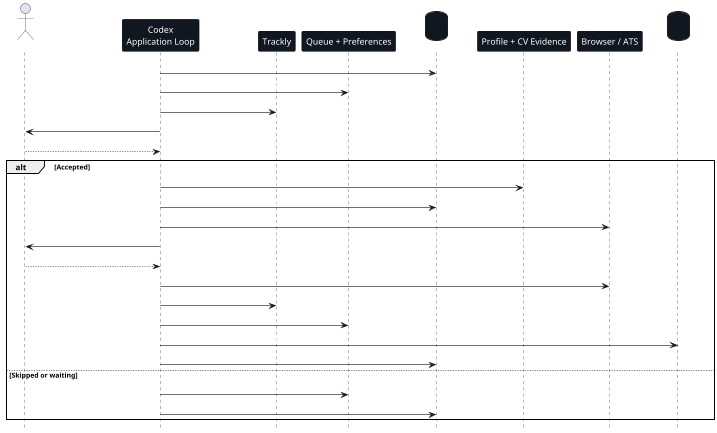

# Application Loop

The Application Loop is the fast path for job-search execution. It finds and
queues roles, asks for a pre-work decision before expensive work, tailors the CV
only after that gate, prepares application forms and submits only after final
approval.

The loop stays focused on applications. After a terminal outcome, it records
whether outreach is worth doing, then leaves contact research and message
drafting to the separate Outreach Loop.

## Sequence



## 1. Search And Queue

The process starts from search preferences and Trackly job discovery. Roles
enter the active Markdown queue first, not an application folder.

```text
applications/
  current-state.md
  job-queue.md
  search-preferences.md
```

The loop reads `current-state.md`, `job-queue.md` and `search-preferences.md`
directly. It does not reconstruct the active queue from vector search.

## 2. Pre-Work Gate

Before creating a job package, Codex shows a compact brief:

- company and product;
- role scope;
- location, work mode and sponsorship implications;
- compensation when known;
- fit and risks;
- same-company history when relevant;
- recommendation: apply, wait, skip or replace focus.

This gate comes before CV tailoring, ATS inspection, application form filling or
submission packet work.

## 3. Job Package

When the pre-work gate is accepted, Codex creates a job workspace:

```text
applications/
  company-role-date/
    job.md
    fit-analysis.md
    cv-tailoring-plan.md
    notes.md
    application-form-draft.md
    submission-checklist.md
    cv-source/
    cv.pdf
```

That folder becomes the local archive for the worked application.

## 4. CV Strategy

Base profile evidence is read directly from:

- `applications/profile-inventory.md`;
- `applications/application-profile.md`.

Retrieval is conditional. Codex queries historical memory only when prior
applications can improve the decision: similar fit analyses, submitted CV
summaries, known ATS lessons, same-company history or narrative risks.

## 5. Build And Submit

The LaTeX CV is compiled locally with TinyTeX/XeLaTeX:

```bash
scripts/build-cv-pdf.sh <application-folder>/cv-source <application-folder>/cv.pdf
scripts/preview-cv-pdf.sh <application-folder>/cv.pdf
```

Codex may inspect and fill application forms after the pre-work gate. It may
click final submit/apply/confirm only after explicit approval for that job.

## 6. Terminal State

After submission, skip or abandonment, the loop updates Trackly and local files,
then removes the job from the active queue. For submitted jobs, Codex writes a
`## Submitted CV Summary` in `notes.md`; that summary is indexed for future CV
strategy, not the PDF or LaTeX build output.

Before moving on, the loop records a lightweight outreach hook when useful:

- one `OPP-*` opportunity row in `outreach-log.md`;
- one `## Outreach` section in the job's `notes.md`;
- no contact research and no message drafting.
