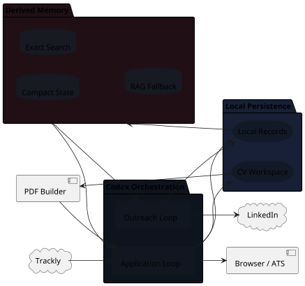

# Architecture

The system is split into two loops with a shared memory layer. The architecture
view shows responsibilities and boundaries; concrete file names live in the
Implementation Reference.

## System Shape


{: .architecture-diagram }

## Component Boundaries

| Component | Boundary |
| --- | --- |
| Application Loop | Owns job discovery, pre-work brief, CV tailoring, application preparation, approval and terminal job updates. |
| Outreach Loop | Owns contact research, ranking, message drafts, sent status and follow-up status. |
| Local Persistence | Stores human-readable operational state, notes, evidence and CV source. |
| Derived Memory | Provides compact state, exact search and RAG fallback; not authoritative. |
| Trackly | Authoritative for live job-posting facts and external status. |
| Browser / ATS | Used only after pre-work approval; final submit requires explicit approval. |
| LinkedIn | Manual surface only; Codex may draft and track, not send or connect. |

## Data Flow

Application path:

```text
Trackly/search
  -> active queue
  -> pre-work brief
  -> accepted job package
  -> CV strategy and form preparation
  -> final approval
  -> browser/ATS submission
  -> Trackly + local folder update
  -> submitted CV summary
  -> optional OPP-* outreach hook
  -> memory rebuild
```

Outreach path:

```text
outreach opportunities
  -> relevant job notes and memory context
  -> public contact research
  -> ranked OUT-* contacts
  -> message drafts
  -> Dario sends manually
  -> sent/reply/follow-up state
  -> memory rebuild
```

## Design Principles

- Keep the application critical path fast.
- Keep outreach out of the application loop.
- Keep the base CV concise and credible.
- Store broader evidence outside the CV.
- Keep claims evidence-backed and NDA-safe.
- Use automation for preparation and approved execution, not for unreviewed
  submission or networking.
- Keep memory derived and targeted: authoritative facts stay in Trackly and
  Markdown, while SQLite/LanceDB only help find the right sections to read.
