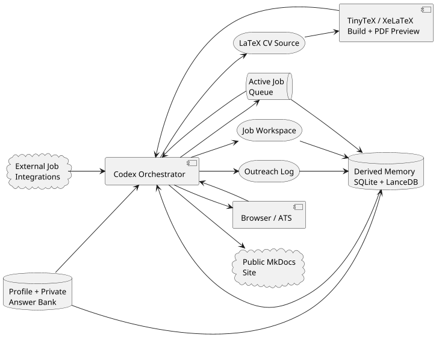

# Architecture

The workflow is intentionally file-first. Most state lives in Markdown or
LaTeX, so future Codex sessions can inspect and continue the process without
needing a hidden application database. The memory layer is derived from those
files: it is a retrieval map, not a competing source of truth.

## System Shape


{: .architecture-diagram }

## Main Components

| Component | Purpose |
| --- | --- |
| `cv-overleaf/` | Git-backed LaTeX CV source, compatible with Overleaf. |
| `applications/job-queue.md` | Active queue for ready, maybe and blocked opportunities. |
| `applications/search-preferences.md` | Mutable role, location, ranking and hard-no preferences. |
| `applications/profile-inventory.md` | Reusable evidence inventory for skills, projects and positioning. |
| `applications/application-profile.md` | Private reusable answer bank, personal details and form guardrails. |
| `applications/outreach-log.md` | Central tracker for manual LinkedIn outreach opportunities, ranked contacts, message drafts and follow-up status. |
| `applications/current-state.md` | Generated compact state read first by the job and outreach loops. |
| `applications/company-aliases.yml` | Canonical company identity map using Trackly company id, domain and aliases. |
| `applications/retrieval/` | Derived SQLite FTS and LanceDB semantic fallback index for targeted context retrieval. |
| `applications/<job>/` | Archive for worked applications: job notes, fit analysis, tailoring plans, CV source/PDF and submission notes. |
| `codex-managed-application-workflow/` | Public documentation of the workflow itself. |

## External Services And Tools

| Tool | Role |
| --- | --- |
| Overleaf | Remote LaTeX editing and PDF rendering when needed. |
| GitHub | Versioned CV/project repositories. |
| TinyTeX / XeLaTeX | Local LaTeX compilation, page-count checks and PDF preview. |
| Trackly | External job discovery integration, saved jobs and job metadata. |
| SQLite FTS | Exact local lookup by company, heading, Trackly id and keywords. |
| LanceDB + FastEmbed | Local semantic fallback when exact lookup is insufficient. |
| Codex | File editing, review loops, Codex-executed applications, browser-assisted submission and workflow orchestration. |
| Browser | Form inspection, form filling and human-approved application submission. |
| LinkedIn | Manual user-controlled outreach surface; Codex drafts messages and tracks state but does not auto-send or auto-connect. |

## Data Flow

```text
external job integrations
  -> relevant job posting
  -> active job queue
  -> compact current-state read
  -> targeted same-company / historical retrieval when needed
  -> pre-work brief and user acceptance
  -> ready job package
  -> fit analysis
  -> profile evidence lookup
  -> private answer-bank lookup
  -> one-question missing-data loop
  -> LaTeX CV edits
  -> local compile and preview
  -> submission packet
  -> browser application flow
  -> human approval
  -> Codex-executed submission
  -> Trackly/folder update
  -> submitted CV summary
  -> memory index rebuild
  -> remove from active queue
  -> outreach opportunity log
  -> daily contact research and ranked message drafts
  -> manual LinkedIn sending
  -> sent/reply/follow-up status update
```

## Design Principles

- Keep the base CV concise and credible.
- Store broader evidence outside the CV.
- Prefer role-specific variants over one bloated resume.
- Keep the active queue small enough to work, but persistent enough to resume.
- Gate expensive work early: brief first, prepare only after the user accepts
  the specific role.
- Keep claims evidence-backed and NDA-safe.
- Use automation for application execution, not for unreviewed submission.
- Keep outreach outside the application critical path; record intent quickly and
  do contact research in a separate daily loop.
- Keep memory derived and targeted: authoritative facts stay in Trackly and
  Markdown, while SQLite/LanceDB only help find the right sections to read.
- Make the workflow inspectable by future Codex sessions.
