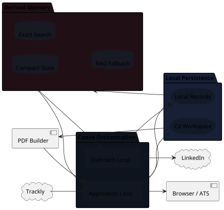

# Architecture

The system is split into two loops with a shared memory layer. The architecture
view shows responsibilities and boundaries; concrete file names live in the
Implementation Reference.

## System Shape


{: .architecture-diagram }

## Codex Orchestration

This is the active agent layer. It contains two loops with different
responsibilities.

| Loop | Responsibility |
| --- | --- |
| Application Loop | Finds jobs, shows the pre-work brief, tailors the CV, prepares the application, asks for final approval and updates terminal job state. |
| Outreach Loop | Reviews outreach opportunities, researches public contacts, ranks people, drafts messages and records manual sending/follow-up state. |

The split matters because outreach should not slow down the application critical
path. The Application Loop only records whether outreach is worth doing; the
Outreach Loop handles contact research later.

## Local Persistence

Local Persistence is the human-readable record of the workflow. It stores
operational state, decisions, notes, CV evidence, outreach rows and CV source
workspaces.

This layer is authoritative for local decisions: skipped roles, blockers,
outreach status, CV strategy notes and user-provided profile facts live here.
The exact file names are listed in the Implementation Reference.

## Derived Memory

Derived Memory is generated from Local Persistence. It exists to help Codex find
the right context quickly; it does not replace the underlying records.

It has three responsibilities:

- `Compact State`: a small first-read snapshot for both loops.
- `Exact Search`: deterministic lookup by company, id, heading or keyword.
- `RAG Fallback`: semantic retrieval when exact search is not enough.

The output of this layer is a context pack, not a database transaction or a new
source of truth.

## External Systems

External systems sit at the boundary of the workflow.

| System | Boundary |
| --- | --- |
| Trackly | Live job facts, job discovery and external application status. |
| Browser / ATS | Application form inspection, filling and approved submission. |
| PDF Builder | Local CV compilation and page-count checks. |
| LinkedIn | Manual networking surface; Codex may draft and track, not send or connect. |

## Data Flow

Application path:

```text
Trackly/search
  -> active queue
  -> pre-work brief
  -> accepted job package
  -> CV strategy and form preparation
  -> final approval
  -> browser/ATS submission
  -> Trackly + local folder update
  -> submitted CV summary
  -> optional OPP-* outreach hook
  -> memory rebuild
```

Outreach path:

```text
outreach opportunities
  -> relevant job notes and memory context
  -> public contact research
  -> ranked OUT-* contacts
  -> message drafts
  -> Dario sends manually
  -> sent/reply/follow-up state
  -> memory rebuild
```

## Design Principles

- Keep the application critical path fast.
- Keep outreach out of the application loop.
- Keep the base CV concise and credible.
- Store broader evidence outside the CV.
- Keep claims evidence-backed and NDA-safe.
- Use automation for preparation and approved execution, not for unreviewed
  submission or networking.
- Keep memory derived and targeted: authoritative facts stay in Trackly and
  Markdown, while SQLite/LanceDB only help find the right sections to read.
