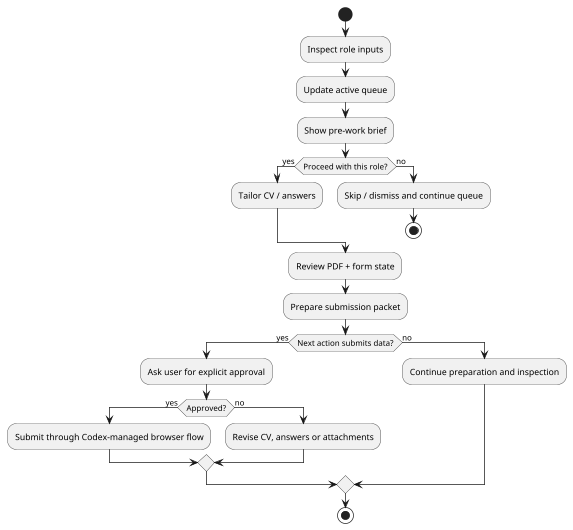

# Guardrails

The workflow is designed to increase leverage without sacrificing truthfulness
or control. Codex can search, queue and brief roles freely. Expensive
application work is gated before it starts: Codex must summarize the company,
role, location/work mode, sponsorship implications and risks before creating a
package, tailoring the CV or filling forms. Final submission for each job
remains separately human-approved, but that final gate is intentionally
lightweight when the earlier pre-work gate already accepted the opportunity.
Manual LinkedIn outreach is tracked separately: Codex may research public
contacts and draft messages, but sending, connecting and replying stay manual.

## Approval Boundary

{: .guardrail-diagram }

## Claim Integrity

Every CV claim should map back to one of:

- work evidence;
- project evidence;
- education evidence;
- explicit profile notes from the user.

If a skill is not yet backed by enough evidence, it can stay in the profile
inventory but should not become a base-CV headline.

## Human Approval

There are two human gates:

- Pre-work approval: required before package creation, CV tailoring, PDF build,
  ATS inspection/fill or submission packet work for a specific job.
- Final submission approval: required before clicking submit/apply/confirm or
  using an autoapply channel for that specific job. This should be a short
  safety check, not a second full role evaluation.

Codex can search, queue and brief roles without asking. After the pre-work gate
passes, Codex can prepare, inspect, draft and attach without asking again unless
new missing or sensitive information appears. It can submit through the browser
or an autoapply channel only after the lightweight final submit gate passes.

This avoids turning the workflow into an uncontrolled application bot.

The practical approval rhythm is:

1. Pre-work gate: "Is this role worth preparing?"
2. Preparation: Codex handles CV, PDF, form and notes.
3. Final submit gate: "Here is the final artifact and sensitive answers; approve
   the actual submit click?"

## Outreach Boundary

After an application is submitted, skipped or abandoned, Codex may mark the role
as worth outreach in `applications/outreach-log.md`. That is a lightweight state
update, not a networking action.

The daily outreach loop may:

- search public web sources for relevant people;
- prepare LinkedIn search queries or public profile links;
- rank all sensible contacts;
- draft short messages and light follow-ups;
- update rows after the user reports which `OUT-*` ids were actually sent.

It may not auto-send, auto-connect, scrape LinkedIn pages, or click LinkedIn
buttons. This keeps networking human-controlled and avoids turning the workflow
into spam automation.

## Private Application Profile

Personal details and recurring form answers live in a private local Markdown
application profile. Codex may reuse stored answers in local drafts and
application preparation. If an answer is missing, ambiguous, sensitive or
legally material, Codex asks one question, saves the answer, then resumes the
same application.

## NDA-Safe Wording

For NDA-covered work, the workflow prefers anonymous but concrete phrasing:

- enterprise client environments;
- internal/external API integrations;
- production-facing modules;
- silver/gold analytical layers;
- decision-support workflows;
- data quality controls;
- design-to-release ownership.

It avoids client names, sensitive domains, private metrics or implementation
details that should not leave the work context.

## Role-Specific Emphasis

The base CV should remain focused. Specialized skills such as agentic AI,
LangChain, Agno, LangSmith-style evaluation workflows and MCP tooling are kept
in the profile inventory until a role explicitly calls for them.

This prevents the CV from becoming a broad keyword list.

## No False Automation Claims

The workflow can state that the CV was reorganized and submitted through a
personal Codex-managed process, but it should also state that submission
required human approval.

That distinction matters.

The fixed base-CV line is:

> CV submitted through a personal Codex workflow after human approval, with
> automated job discovery, CV tailoring, application submission and manual
> outreach tracking. See projects for details.

## Queue Discipline

The active queue is not a public archive or proof of submission. Worked
applications live in their own folders, and external status lives in Trackly.
After submit or skip, Codex updates those records and removes the job from the
active queue so future sessions do not reprocess it.

Jobs that fail the pre-work gate should be dismissed or moved out of the active
queue before any CV/form work happens.
