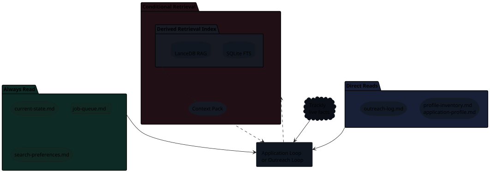

# Memory And Retrieval

The two loops share a local memory layer, but that layer does not replace the
original sources of truth. Trackly remains authoritative for live job-posting
facts and external application status. Markdown remains authoritative for local
decisions, CV work, notes, outreach and reusable personal/profile data. The
retrieval index is a derived map that helps Codex fetch only the right context
instead of loading the whole application archive.

## Memory Shape

The loops keep a small always-read context in front of Codex. Larger historical
context is pulled only when a decision needs it.


{: .memory-diagram }

## Always Read

These files are small enough and important enough to read at loop start. They
give Codex the current operating state without querying the archive.

| File | Why It Is Always Read |
| --- | --- |
| `current-state.md` | Compact snapshot of queue health, recent applications, outreach due and memory status. |
| `job-queue.md` | The active application worklist and local blockers. |
| `search-preferences.md` | Role, location, ranking, compensation and hard-no rules. |

The active queue is never reconstructed from RAG. It is read directly.

??? info "Queue Shape"

    The queue is the short operational worklist for jobs that still need action.
    It is not an archive of every job ever touched.

    It is organized into three sections:

    | Section | Meaning |
    | --- | --- |
    | `Ready` | Jobs accepted by the pre-work gate or close enough to continue. |
    | `Maybe` | Plausible jobs that need a brief before promotion. |
    | `Blocked` | Jobs paused by location, sponsorship, ATS failure, poor fit or explicit user decision. |

    Each active row carries the information needed to decide the next move
    without opening the whole archive: priority, local status, company, role,
    location, Trackly id, autoapply flag, job URL and next action. Blocked rows
    replace location/URL detail with the blocker and the condition for
    revisiting.

    Completed, skipped or abandoned applications leave the queue and move into
    the application folder plus Trackly status. This keeps the queue small
    enough to read every loop start.

??? info "Current State Shape"

    `current-state.md` is generated from local files. It gives the loops a
    compact dashboard before they do deeper work:

    - control metadata and memory health;
    - ready, maybe and blocked queue counts;
    - recent application folders and Trackly ids;
    - open outreach opportunities and follow-up counts;
    - retrieval index health;
    - stale-state or low-queue warnings.

    It is a convenience snapshot, not a source of truth. If it conflicts with
    Trackly or local Markdown, the loop checks the original source.

??? info "Preference Shape"

    `search-preferences.md` is the standing policy file. It tells the loop how
    to rank or reject jobs before spending time on CV tailoring or ATS work.

    It contains target role families, company and location preferences,
    seniority rules, hard-no constraints, ATS automation notes and approval
    gates. This is where broad rules live, such as preferring AI/data/platform
    work, avoiding pure ML research roles unless the scope is actually
    platform/tooling, and requiring explicit approval before external
    submission.

## Direct Reads

These sources are canonical for their workflow, but not every loop needs them on
every turn.

| Source | Read When |
| --- | --- |
| `profile-inventory.md` | The Application Loop needs base evidence for CV strategy. |
| `application-profile.md` | The Application Loop needs reusable form answers or personal guardrails. |
| `outreach-log.md` | The Outreach Loop needs opportunities, contact rows, sent status or follow-ups. |

Direct reads are different from retrieval: Codex opens the source of truth, not
a derived chunk selected by search.

??? info "Profile Shape"

    The "profile" is split into two files because they answer different
    questions.

    | Source | What It Means |
    | --- | --- |
    | `profile-inventory.md` | Evidence inventory for CV strategy: skills, work evidence, project evidence, positioning, guardrails and what can honestly be emphasized. |
    | `application-profile.md` | Reusable application-form answers: personal details, work authorization, education, language answers, recurring ATS answers and consent rules. |

    The inventory is used when Codex asks, "what should this CV emphasize for
    this role?" The application profile is used when Codex asks, "what honest
    answer should go into this form field?"

    Neither file is a final CV. The CV is built from them, the role description
    and the application-specific fit analysis.

??? info "Outreach Shape"

    `outreach-log.md` has two levels:

    | Level | Purpose |
    | --- | --- |
    | Opportunities | One row per worked job where outreach may help, with priority, status, company, role, folder, Trackly id, job URL and reason. |
    | Contacts | One row per person to message, with stable `OUT-*` id, relevance, source, LinkedIn target, ranking reason, draft, sent date, follow-up date and notes. |

    The Application Loop only creates or updates the opportunity level after a
    job reaches a terminal application state. The Outreach Loop later researches
    people, ranks contacts and drafts messages.

## Conditional Retrieval

Conditional retrieval is for historical context that may be useful but should
not be loaded by default.

| Decision Point | What It Looks For | Output |
| --- | --- | --- |
| Same-company check | Prior folders, Trackly ids, aliases and previous role/status notes. | Prior applications plus an apply/skip/wait recommendation. |
| CV strategy | Similar `fit-analysis.md` sections, submitted CV summaries and relevant profile evidence. | Role-specific emphasis, risks and honest positioning. |
| ATS/debug audit | Prior `notes.md` sections about form fields, browser failures, verification issues or submission outcomes. | The likely source sections to inspect before retrying or abandoning. |
| Outreach review | `outreach-log.md`, job `notes.md#Outreach` and relevant high-fit applications. | Outreach opportunities, follow-up state or contact-message context. |

??? info "Retrieval Index Scope"

    These files remain Markdown sources of truth. The index is only a derived
    lookup layer over selected sections, queried when conditional retrieval is
    needed.

    The v1 retrieval index includes curated operational Markdown:

    - root workflow files: `job-queue.md`, `search-preferences.md`,
      `application-profile.md`, `profile-inventory.md` and `outreach-log.md`;
    - application folders: `job.md`, `fit-analysis.md` and `notes.md`.

    Each worked job has a local folder:

    | File | Indexed Meaning |
    | --- | --- |
    | `job.md` | Local copy of the role facts: company, title, location, URL, Trackly id and job description. |
    | `fit-analysis.md` | Decision brief: fit, risks, gaps, CV strategy and why the job was accepted, skipped or abandoned. |
    | `notes.md` | Execution log: ATS details, submission outcome, outreach section, submitted CV summary and follow-up notes. |

    The index excludes generated or high-noise artifacts such as CV PDFs,
    LaTeX source copied into application folders, LaTeX build output,
    screenshots, submission packets and application-form drafts.

??? info "Retrieval Flow"

    Retrieval uses exact search first. Semantic search is a fallback, not the
    default path.

    | Layer | Role |
    | --- | --- |
    | SQLite FTS | Exact lookup by company, Trackly id, heading or keyword. |
    | LanceDB RAG | Semantic fallback over curated Markdown chunks when exact lookup is not enough. |

    This is why the index is useful even when the underlying files are still
    Markdown: SQLite points to the right local sections quickly, while LanceDB
    helps only when the wording is fuzzy or the relevant history is not obvious.

??? info "Context Pack And Boundary"

    The Context Pack is the output of conditional retrieval. It is not raw
    memory and it is not a new source of truth.

    It should be a short, cited brief that says:

    - which local sections matter;
    - what prior decisions or risks they contain;
    - whether Trackly and local notes conflict;
    - what the active loop should read or decide next.

    For larger context decisions, Codex can delegate a read-only retrieval
    subagent. The subagent may check Trackly for live facts, query SQLite/FTS,
    use semantic fallback and open cited Markdown sections, but it cannot modify
    files, update Trackly, change outreach state, send LinkedIn messages, scrape
    LinkedIn or click LinkedIn buttons.

## Freshness And Failure

??? info "Build And Freshness"

    Generated memory artifacts live under:

    ```text
    applications/
      current-state.md
      company-aliases.yml
      retrieval/
        chunks.sqlite
        lancedb/
    ```

    `company-aliases.yml` keeps company identity consistent across local
    folders and Trackly. Trackly company id wins first, company domain second
    and aliases last. This helps same-company checks avoid treating small naming
    differences as different companies.

    If the index is missing or stale, the loop runs:

    ```bash
    /Users/dariodm/Documents/ai-managed-documents/scripts/workflow-memory.sh ensure
    ```

    After queue, notes, fit analysis, profile, outreach or alias mutations, the
    loop rebuilds:

    ```bash
    /Users/dariodm/Documents/ai-managed-documents/scripts/workflow-memory.sh build
    ```

??? info "Degraded Mode"

    If retrieval fails, the active loop continues. Codex falls back to Trackly,
    always-read files, direct workflow reads and targeted `rg`, then reports
    that memory retrieval is degraded.
