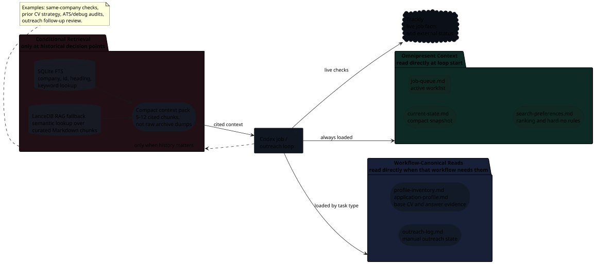

# Memory And Retrieval

The workflow now has a local memory layer, but it does not replace the original
sources of truth. Trackly remains authoritative for live job-posting facts and
external application status. Markdown remains authoritative for local decisions,
CV work, notes, outreach and reusable personal/profile data. The retrieval
index is a derived map that helps Codex fetch only the right context instead of
loading the whole application archive.

## Memory Shape

The loop keeps a small always-read context in front of Codex, then retrieves
historical chunks only when a decision needs them.


{: .memory-diagram }

## Source Boundaries

| Source | Role |
| --- | --- |
| Trackly | Live job facts, job ids, company ids and externally recorded application status. |
| `job-queue.md` | Active local worklist and local blockers. |
| `search-preferences.md` | Role, location, ranking, compensation and hard-no preferences. |
| `profile-inventory.md` | Reusable evidence for skills, projects, work history and positioning. |
| `application-profile.md` | Private reusable answers and form guardrails. |
| `outreach-log.md` | Manual LinkedIn outreach opportunities, contacts, message drafts and follow-up state. |
| Application folders | Local archive for worked jobs: job snapshot, fit analysis, notes, CV plan and submission state. |
| Retrieval index | SQLite FTS plus semantic fallback used only to find relevant chunks. |

## Generated Files

```text
applications/
  current-state.md
  company-aliases.yml
  retrieval/
    chunks.sqlite
    lancedb/
```

`current-state.md` is the first compact read for job and outreach loops. It
summarizes active queue shape, recent applications, outreach due and memory
health. `company-aliases.yml` keeps canonical company identity stable, preferring
Trackly company id first, domain second and aliases last.

`chunks.sqlite` stores deterministic chunk metadata and full-text search. LanceDB
with local FastEmbed embeddings is used only as semantic fallback when exact
metadata or FTS is not enough.

## Indexed Content

The v1 index includes curated operational Markdown:

- root workflow files: `job-queue.md`, `search-preferences.md`,
  `application-profile.md`, `profile-inventory.md` and `outreach-log.md`;
- application folders: `job.md`, `fit-analysis.md` and `notes.md`.

It excludes generated or high-noise artifacts:

- CV PDFs;
- LaTeX source copied into application folders;
- LaTeX build logs and auxiliary files;
- screenshots and form images;
- generated submission packets and application-form drafts.

Final CV information is preserved through a `## Submitted CV Summary` section in
each submitted job's `notes.md`. That summary is the memory-friendly
representation of what was actually sent.

## When Retrieval Runs

The active queue is still read directly from `job-queue.md` and
`current-state.md`. Retrieval is reserved for decision points where historical
context matters:

- pre-work briefs that need prior-company or similar-role history;
- same-company checks and spray-and-pray risk;
- CV strategy when similar prior applications or previous tailoring warnings are
  useful;
- form-answer reuse and ATS/debug audits;
- daily LinkedIn outreach and follow-up review.

If the index is missing or stale, the loop runs:

```bash
/Users/dariodm/Documents/ai-managed-documents/scripts/workflow-memory.sh ensure
```

After queue, notes, fit analysis, profile, outreach or alias mutations, the loop
rebuilds:

```bash
/Users/dariodm/Documents/ai-managed-documents/scripts/workflow-memory.sh build
```

## Retrieval Subagent

For larger context decisions, Codex can delegate a read-only retrieval subagent.
The subagent returns a compact context pack with cited headings rather than raw
file dumps. It may check Trackly for live facts, query SQLite/FTS, use semantic
fallback when needed and open only the cited Markdown sections required to
verify the pack.

The subagent is not allowed to modify files, update Trackly, change outreach
state, send LinkedIn messages, scrape LinkedIn or click LinkedIn buttons.

## Degraded Mode

If retrieval fails, the workflow continues. Codex falls back to Trackly,
`job-queue.md`, `search-preferences.md`, `outreach-log.md`, targeted `rg` and
specific application folders, and reports that memory retrieval is degraded.
