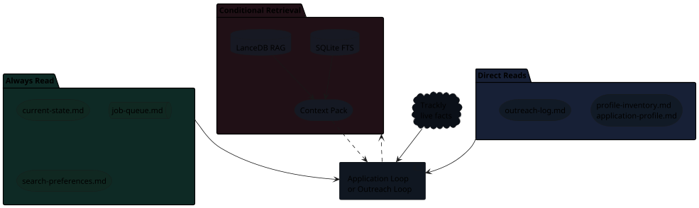

# Memory And Retrieval

The two loops share a local memory layer, but that layer does not replace the
original sources of truth. Trackly remains authoritative for live job-posting
facts and external application status. Markdown remains authoritative for local
decisions, CV work, notes, outreach and reusable personal/profile data. The
retrieval index is a derived map that helps Codex fetch only the right context
instead of loading the whole application archive.

## Memory Shape

The loops keep a small always-read context in front of Codex. Larger historical
context is pulled only when a decision needs it.


{: .memory-diagram }

## Always Read

These files are small enough and important enough to read at loop start. They
give Codex the current operating state without querying the archive.

| File | Why It Is Always Read |
| --- | --- |
| `current-state.md` | Compact snapshot of queue health, recent applications, outreach due and memory status. |
| `job-queue.md` | The active application worklist and local blockers. |
| `search-preferences.md` | Role, location, ranking, compensation and hard-no rules. |

The active queue is never reconstructed from RAG. It is read directly.

## Direct Reads

These sources are canonical for their workflow, but not every loop needs them on
every turn.

| Source | Read When |
| --- | --- |
| `profile-inventory.md` | The Application Loop needs base evidence for CV strategy. |
| `application-profile.md` | The Application Loop needs reusable form answers or personal guardrails. |
| `outreach-log.md` | The Outreach Loop needs opportunities, contact rows, sent status or follow-ups. |

Direct reads are different from retrieval: Codex opens the source of truth, not
a derived chunk selected by search.

## Conditional Retrieval

Conditional retrieval is for historical context that may be useful but should
not be loaded by default.

It runs for decisions such as:

- same-company checks;
- prior CV strategy;
- similar submitted applications;
- ATS/debug audits;
- outreach follow-up review.

Retrieval uses exact search first and semantic search only when exact lookup is
not enough:

| Layer | Role |
| --- | --- |
| SQLite FTS | Exact lookup by company, Trackly id, heading or keyword. |
| LanceDB RAG | Semantic fallback over curated Markdown chunks. |

## Context Pack

The Context Pack is the output of conditional retrieval. It is not raw memory
and it is not a new source of truth.

It should be a short, cited brief that says:

- which local sections matter;
- what prior decisions or risks they contain;
- whether Trackly and local notes conflict;
- what the active loop should read or decide next.

The pack is useful because it lets Codex carry just the relevant history into a
decision, instead of loading every application folder.

## Index Scope

The v1 index includes curated operational Markdown:

- root workflow files: `job-queue.md`, `search-preferences.md`,
  `application-profile.md`, `profile-inventory.md` and `outreach-log.md`;
- application folders: `job.md`, `fit-analysis.md` and `notes.md`.

It excludes generated or high-noise artifacts:

- CV PDFs;
- LaTeX source copied into application folders;
- LaTeX build logs and auxiliary files;
- screenshots and form images;
- generated submission packets and application-form drafts.

Final CV information is preserved through a `## Submitted CV Summary` section in
each submitted job's `notes.md`. That summary is the memory-friendly
representation of what was actually sent.

## Build And Freshness

Generated memory artifacts live under:

```text
applications/
  current-state.md
  company-aliases.yml
  retrieval/
    chunks.sqlite
    lancedb/
```

If the index is missing or stale, the loop runs:

```bash
/Users/dariodm/Documents/ai-managed-documents/scripts/workflow-memory.sh ensure
```

After queue, notes, fit analysis, profile, outreach or alias mutations, the loop
rebuilds:

```bash
/Users/dariodm/Documents/ai-managed-documents/scripts/workflow-memory.sh build
```

## Retrieval Subagent

For larger context decisions, Codex can delegate a read-only retrieval subagent.
The subagent returns a Context Pack with cited headings rather than raw file
dumps. It may check Trackly for live facts, query SQLite/FTS, use semantic
fallback when needed and open only the cited Markdown sections required to
verify the pack.

The subagent is not allowed to modify files, update Trackly, change outreach
state, send LinkedIn messages, scrape LinkedIn or click LinkedIn buttons.

## Degraded Mode

If retrieval fails, the active loop continues. Codex falls back to Trackly,
always-read files, direct workflow reads and targeted `rg`, then reports that
memory retrieval is degraded.
