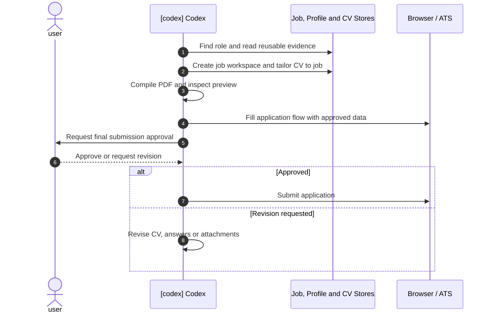

# Workflow

The workflow treats an application as a small delivery pipeline: intake the
role, reason about fit, reshape the CV, verify the artifact, prepare the
application flow, then submit only after approval.

## Execution Sequence



## 1. Job Intake

The process starts from a job posting, usually found through external
job-discovery integrations such as Trackly or opened directly in the browser.
The role is captured in an application folder together with the job
description, fit analysis and notes.

Typical folder shape:

```text
applications/
  company-role-date/
    job.md
    fit-analysis.md
    cv-tailoring-plan.md
    notes.md
```

## 2. Evidence And Application Data Lookup

Codex reads the reusable profile inventory before proposing CV changes. The
inventory stores skills, projects, work evidence, preferences and guardrails
that may not all belong in the base CV.

Codex can also read a private local Markdown application profile. That file
accumulates personal details, recurring application answers, work-authorization
notes and consent rules progressively across applications. It is used to
prefill forms only after explicit confirmation, especially when data would be
sent to external ATS pages.

This separates three concerns:

- the CV remains concise and role-specific;
- the profile inventory remains broad and reusable;
- recurring personal/form data is stored privately instead of being rediscovered
  for every application.

## 3. CV Tailoring

Codex edits the LaTeX source directly, usually in small scoped changes:

- reorder projects for the role;
- emphasize the strongest relevant evidence;
- remove lower-priority skills;
- adjust wording to keep claims accurate;
- avoid exceeding one page.

The current base CV emphasizes data/platform/backend evidence, with the NYC
Urban Mobility Data Platform as the flagship public project.

This per-job tailoring is part of the current workflow. Future reusable CV
tracks are only starting points for recurring role families, not a replacement
for tailoring each application to the actual job request.

## 4. Review Loop

The CV can be reviewed through multiple simulated CV-reader perspectives:

- high-end consulting;
- serious product company;
- big-tech or FAANG-style screening;
- data/platform scaleup.

The goal is not to optimize for one generic recruiter, but to understand how
the same evidence reads under different hiring biases.

## 5. Local Compile And Preview

The LaTeX CV is compiled locally with TinyTeX. The generated PDF is checked for
page count and previewed before use.

```bash
cd cv-overleaf/techResume-main
xelatex -interaction=nonstopmode -halt-on-error resume.tex
```

## 6. Application

Application forms can be completed with Codex using the browser, and the final
submission can also be executed through the Codex-managed workflow. Submission
is still a separate approval step after the CV, form data and attachments have
been reviewed.

Codex may help map fields, reuse approved personal data from the private
application profile, prepare answers, attach the CV and identify required
information. It must not click final submit/apply/confirm unless the user
explicitly approves that final action.
