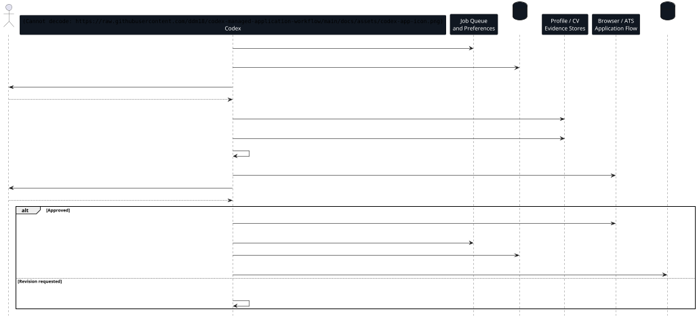

# Workflow

The workflow treats job applications as a persistent queue-driven pipeline:
discover and rank roles, show a short pre-work brief before spending effort on
any job, tailor the CV only after that gate, ask for missing data one question
at a time, save reusable answers, prepare a lightweight final submit check, then
submit only after final approval. After an application reaches a terminal
state, the loop records whether manual outreach is worth doing, while a
separate daily outreach loop researches people and drafts messages. A derived
local memory layer keeps the context targeted: the loop reads compact state
first and retrieves historical chunks only when a decision needs them.

## Execution Sequence



## 1. Search And Queue

The process starts from search preferences and external job-discovery
integrations such as Trackly. Roles first enter an active Markdown queue, not an
application folder. The queue distinguishes ready, maybe and blocked work so
future Codex sessions can continue without rediscovering state.

The loop refills when fewer than three jobs are ready, keeps a soft cap around
five ready jobs, and still saves unusually strong roles found in the same search
batch. Jobs stay lightweight until the user accepts a short pre-work brief.
That brief is mandatory before package creation, CV tailoring or ATS/form work,
even if a job is already marked ready.

Active queue shape:

```text
applications/
  current-state.md
  job-queue.md
  search-preferences.md
  outreach-log.md
```

The queue is not reconstructed through vector search. At loop start Codex reads
`current-state.md`, `job-queue.md` and `search-preferences.md` directly, then
ensures the retrieval index only if it is missing or stale.

## 2. Pre-Work Gate

Before creating a job package, Codex summarizes:

- what the company does;
- what the role entails;
- location, work mode and sponsorship implications;
- compensation when known;
- why the role fits the user's positioning;
- risks or reasons to skip.

If the role is outside preferences, such as UK remote with sponsorship, Poland
relocation, weak compensation or a pure full-remote setup, this gate happens
before any CV or form work. The user can reject the role and the loop moves on.

For same-company decisions, Codex checks Trackly for live job facts and local
Markdown for prior local decisions. The brief must show previous roles/statuses,
whether the new role is meaningfully different, spray-and-pray risk and a clear
apply, wait, skip or replace recommendation.

## 3. Job Package

When the pre-work gate is accepted, Codex creates a job workspace. That folder
becomes the archive for worked applications.

```text
applications/
  company-role-date/
    job.md
    fit-analysis.md
    cv-tailoring-plan.md
    notes.md
    application-form-draft.md
    submission-checklist.md
    cv-source/
    cv.pdf
```

## 4. Evidence And Application Data Lookup

Codex reads the reusable profile inventory before proposing CV changes. The
inventory stores skills, projects, work evidence, preferences and guardrails
that may not all belong in the base CV.

For CV strategy, base evidence still comes directly from `profile-inventory.md`
and `application-profile.md`. Retrieval is used only for historical context such
as similar prior `fit-analysis.md` files, submitted CV summaries, known ATS
lessons or narrative warnings.

Codex can also read a private local Markdown application profile. That file is
an answer bank for personal details, recurring form answers, work-authorization
notes and consent rules. Missing data is gathered one question at a time; after
the user answers, reusable information is saved and reused for future drafts
unless the current form changes the meaning or the data is sensitive.

This separates three concerns:

- the CV remains concise and role-specific;
- the profile inventory remains broad and reusable;
- recurring personal/form data is stored privately instead of being rediscovered
  for every application.

## 5. CV Tailoring

Codex edits the LaTeX source directly, usually in small scoped changes:

- reorder projects for the role;
- emphasize the strongest relevant evidence;
- remove lower-priority skills;
- adjust wording to keep claims accurate;
- avoid exceeding one page.

The current base CV emphasizes data/platform/backend evidence, with the NYC
Urban Mobility Data Platform as the flagship public project.

This per-job tailoring is part of the current workflow. Future reusable CV
tracks are only starting points for recurring role families, not a replacement
for tailoring each application to the actual job request.

After submission, Codex records a `## Submitted CV Summary` in the job's
`notes.md`. That summary, not the PDF or LaTeX build output, is what the memory
layer indexes for future CV-strategy retrieval.

## 6. Review Loop

The CV can be reviewed through multiple simulated CV-reader perspectives:

- high-end consulting;
- serious product company;
- big-tech or FAANG-style screening;
- data/platform scaleup.

The goal is not to optimize for one generic recruiter, but to understand how
the same evidence reads under different hiring biases.

## 7. Local Compile And Preview

The LaTeX CV is compiled locally with TinyTeX. The generated PDF is checked for
page count and previewed before use. The local workspace uses a small wrapper
script around XeLaTeX so future sessions do not fall back to incompatible
tooling.

```bash
scripts/build-cv-pdf.sh <application-folder>/cv-source <application-folder>/cv.pdf
scripts/preview-cv-pdf.sh <application-folder>/cv.pdf
```

Tectonic is intentionally not used for this CV template on the current machine:
the local TinyTeX/XeLaTeX path matches the Overleaf rendering more reliably,
including FontAwesome icons and `pdfx` metadata.

## 8. Application And Queue Exit

Application forms can be completed with Codex using the browser after the
pre-work gate has passed. The final submission can also be executed through the
Codex-managed workflow. Submission is still a separate approval step after the
CV, form data and attachments have been reviewed, but it is intentionally
lighter than the pre-work gate.

Before final approval, Codex prepares a compact submit check: CV path,
attachments, sensitive form answers, any new surprises since the pre-work gate
and the exact submit channel. It must not click final submit/apply/confirm
unless the user explicitly approves that specific job. After submission or
skip, Codex updates Trackly and the application folder, then removes the job
from the active queue.

Before continuing to the next role, Codex performs a lightweight outreach hook.
For strategically useful roles, it records one `OPP-*` opportunity in
`applications/outreach-log.md` and adds a short `## Outreach` section to the job
notes. This hook does not search LinkedIn or draft messages; it only preserves
enough context for a later daily outreach pass. The memory index is rebuilt
after these terminal-state updates.

## 9. Daily Outreach Loop

The separate `linkedin-outreach-loop` skill reads the outreach log and worked
application folders, reads compact memory state, researches public sources for
relevant people, ranks all sensible contacts and drafts concise LinkedIn
messages for manual sending.

Contacts receive stable `OUT-*` ids. After the user sends messages manually,
they can reply with ids such as `scritto OUT-001, OUT-004`; Codex then marks
only those contacts as sent and schedules a light follow-up for high-priority
contacts.
